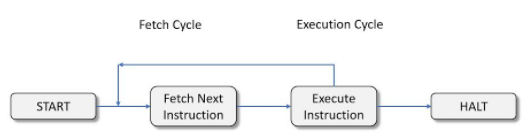

# CPU 의 명령어 수행 과정

## 명령어 사이클

CPU가 프로그램을 실행하기 위해 명령어를 처리하는 과정은 크게 2가지로 나누어진다

> Instruction Cycle = Fetch Cycle + Execute Cycle
> 

- Fetch Cycle : 메모리에서 명령어, 데이터를 CPU로 가져오는 단계
- Execute Cycle : CPU가 명령어를 실행하는 단계

**명령어 사이클의 단계**

1. **명령어 인출** (Instruction fetch) : 명령어 주소를 계산하고 그 주소의 메모리로부터 명령어를 가져오는 단계
2. **명령어 해독** (Instruction decode) : 가져온 명령어가 어떤 것들이 필요하고, 어떤 동작을 하는지 해석
3. **데이터 인출** (Data fetch) : 피연산자가 필요한 명령의 경우 operand fetch 작업 수행
4. **데이터 처리** (Data process) : 명령어에 따라 피연산자들을 연산시키는 작업 수행
5. **데이터 저장** (Data store) : 연산의 결과를 저장하는 작업을 수행

프로그램은 위와 같은 명령어 사이클이 끊임 없이 반복 수행되면서 실행되는 것이다.

### CPU 구조

**ALU (Arithmetic Logic Unit) - 산술 논리 장치**

- 덧셈, 뺄셈과 같은 산술연산과 논리곱, 논리합 같은 논리 연산을 계산하는 CPU 내부 장치

**Control Unit - 제어 장치**

- 컴퓨터에 있는 모든 장치들의 동작을 지시하고 제어하는 장치

**CPU 내부 버스**

- ALU와 레지스터들 간의 데이터 이동을 위한 통로.

**Register Set - 레지스터**

- CPU 내부에 위치한 기억장치 용도에 따라 범용 레지스터와 특수목적 레지스터로 구분된다
- 특수 목적 레지스터의 종류
    - PC (Program Counter) : 다음에 인출될 명령어의 주소를 가지고 있는 레지스터
    - MAR (Memory Address Register) : PC에 저장된 명령어 주소가 주소 버스로 출력되기 전에 일시적으로 저장되는 주소 레지스터
    - MBR (Memory Buffer Register) : 기억장치에 저장될, 혹은 읽혀진 데이터가 일시적으로 저장되는 버퍼 레지스터
    - IR (Instruction register) : 가장 최근에 인출된 명령어가 저장되어 있는 레지스터
    - AC (Accumulator) : 연산 결과 데이터를 일시적으로 저장하는 레지스터

다시 명령어 처리 과정으로 돌아와 보자.

명령어를 처리하는 과정은 Fetch Cycle과 Execute Cycle이 있다고 했었다.

**Fetch Cycle**은 명령어를 인출하는 과정으로 아래와 같은 3단계로 이루어진다

1. MAR ← PC : PC가 가리키는 메모리 주소를 MAR에 저장한다
2. MBR ← M[MAR], PC ← PC + 1 : 메모리의 MAR 주소에서 값을 읽어와 MBR에 저장하고 PC의 값을 1 증가시킨다
3. IR ← MBR : 읽어온 명령어를 IR에 넣는다.

**Execute Cycle** 은 명령어의 종류에 따라 그 수행 과정이 달라진다

1. 데이터 이동 : CPU와 기억장치, I/O 장치 간에 데이터를 이동한다
2. 데이터 처리 : 피연산자에 대해 산술, 논리 연산을 수행한다
3. 데이터 저장 : 연산결과를 기억장치에 저장한다
4. 프로그램 제어 : 프로그램의 실행 순서를 결정한다

### 명령어 포맷

위에서 명령어를 인출하고, 해독하고, 수행하고… 등등의 일들을 했었다.

그러면 이 명령어가 어떻게 생겼는지 더 자세히 알아보자.

위 사진은 개념적으로 형상화한 명령어 포맷이다. 일반적으로 Opcode 와 피연산자를 나타내는 Operand의 데이터나 데이터의 주소를 가진다.

Opcode는 기계어의 일부이며 수행할 명령어를 나타내는 부호를 말한다. 이에 대한 규격과 형식은 프로세서의 명령어 셋에 나와있는데, 이 명령어 셋과 포맷은 CPU 제조사마다 다르기 때문에 개념적으로만 이해하자.

아래는 Intel과 Mac, AMD cpu 의 opcode를 참고용으로 가져와 보았다.

**Intel x86 Opcode**

**MAC OS Opcode**

**ARM Opcode**

