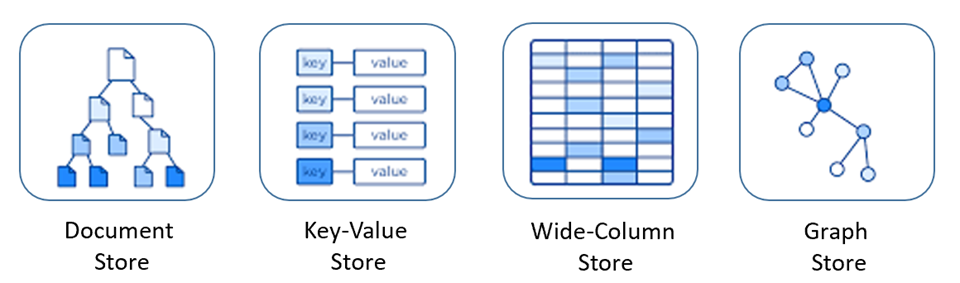

# NoSQL 에 대하여

### NoSQL 이란?

NoSQL은 비관계형 데이터베이스를 지칭한다. 즉, 관계형 데이터 모델을 지양하며 대량의 분산된 데이터를 저장하고 조회하는 데 특화되었으며 스키마 없이 사용 가능하거나 느슨한 스키마를 제공하는 저장소를 말한다

NoSQL은 기존 RDBMS 형태의 관계형 데이터베이스가 아닌 다른 형태의 데이터 저장 기술을 의미하며, 관계형 데이터베이스의 한계를 극복하기 위한 데이터 저장소의 새로운 형태이다.

### NoSQL의 장단점

**장점**

- 스키마가 없기 때문에 유연하다. 즉 언제든지 데이터를 조정하고 새로운 필드를 추가할 수 있음
- 수직 및 수평적 확장(샤딩)이 가능하므로 데이터베이스가 애플리케이션에서 발생시키는 모든 일기/쓰기 요청 처리가 가능하다
- 데이터는 애플리케이션이 필요로 하는 형식으로 저장된다. 이렇게 하면 데이터를 읽어오는 속도가 빨라진다

**단점**

- 데이터베이스 일관성에 약하다. (일관선을 가용성, 분할 용인, 속도와 맞바꿈)
- 스키마가 정해져 있지 않아, 데이터에 대한 규격화가 되어 있지 않다
- 데이터가 여러 컬렉션에 중복되어 있어서 데이터를 UPDATE 하는 경우 모든 컬렉션에서 수행해야 하기 때문에 느리다
- 데이터 중복으로 인한 수정 작업의 번거로움

### RDB vs NoSQL

|  | RDB | NoSQL |
| --- | --- | --- |
| 데이터 모델 | 고정행, 열이 있는 테이블 | document, key-value, graph, column family  |
| 예시 | MySQL, Oracle, PostgreSQL | MongoDB, Redis, Hbase, Neo4j |
| 목적 | 범용 | 범용, 대량의 데이터 추출, 관계분석, 탐색 등 |
| 스키마 | 엄격 | 유연 |
| 확장성 | 수직 | 수평 |
| ACID 트랜잭션 | 지원 | 대부분 지원하지 않음 |
| ORM | ORM 필요 | 대부분 ORM이 필요 없음 |

### NoSQL 의 종류

RDB의 경우 MySQL이나 Oracle이나 문법은 다르지만 테이블로 저장된다는 형태는 같다.

반면 NoSQL은 대표적으로 아래와 같은 4가지의 형태가 있다. 때문에 NoSQL을 적용하기로 했다면 아래의 4가지 형태 중 한가지를 애플리케이션에 맞게 선택해야 한다.



**Document Store**

- MongoDB
- CouchDB

**Key-Value Store**

- Redis
- riak

**Wide-Column Store (Column Family)**

- Cassandra
- HBase

**Graph Store**

- neo4j
- OrientDB


### Key-Value database

- 키와 값으로 이루어진, 저장과 조회라는 가장 간단한 원칙에 충실한 데이터베이스
- key-value 데이터베이스의 Key 값은 unique한 고유값으로 유지되어야 한다
- 테이블간 조인을 고려하지 않으므로 RDB에서 관리하는 외부키나, 컬럼별 제약조건이 필요없다
- 값에 모든 데이터 타입을 허용하며, 그래서 개발자들이 데이터 입력 단계에서 검증 로직을 제대로 구현하는 것이 중요하다.

**주 사용 예시**

1. 성능 향상을 위해 관계형 데이터베이스에서 데이터 캐싱
2. 장바구니와 같은 웹 애플리케이션에서 일시적인 속성 추적
3. 모바일 애플리케이션용 사용자 데이터 정보와 구성 정보 저장
4. 이미지나 오디오 파일 같은 대용량 객체 저장

### Document Database

- Key-Value 데이터에비스와 같이 데이터 저장에 Key-Value 타입을 사용한다.
- Key-Value DB와의 차이점은 Document DB는 값을 문서로 저장한다는 점.
    - 문서란? semi-structured entity이며 보통 JSON이나 XML과 같은 형식을 따른다
- 값을 저장하기 전에 schema를 별도로 정의하지 않으며, 문서를 추가하면 그게 schema가 된다
- 각 문서별로 다른 필드를 가질 수 있으며,개발자가 애플리케이션에서 데이터를 입력하는 단계에서 컬럼과 필드의 관리가 제대로 이루어지도록 보장하는 것이 매우 중요하다

> **예시 - MongoDB의 AirBnB 데이터셋 일부**
> 

```json
{
"_id": "10006546",
"listing_url": "https://www.airbnb.com/rooms/10006546",
"name": "Ribeira Charming Duplex",
"summary": "Fantastic duplex apartment with three bedrooms, located in the historic area of Porto, Ribeira (Cube)...",
"house_rules": "Make the house your home...",
"property_type": "House",
"calendar_last_scraped": {
    "$date": {
       "$numberLong": "1550293200000"
        }
    },
"amenities": [
    "TV",
    "Cable TV",
    "Wifi",
    "Kitchen",
    "Paid parking off premises",
    "Smoking allowed",
    "Microwave"
    ]
}
```

**주 사용 예시**

1. 대용량 데이터를 읽고 쓰는 웹 사이트용 백엔드 지원
2. 제품처럼 다양한 속성이 있는 데이터 관리
3. 다양한 유형의 메타데이터 추적
4. JSON 데이터 구조를 사용하는 애플리케이션
5. 비정규화된 중첩 구조의 데이터를 사용하는 애플리케이션

### Column Family Database

- 대용량 데이터, 읽기와 쓰기 성능, 고가용성을 위해 설계되었다.
- 구글에서 Big Table을 도입하고, 페이스북에서 Cassandra를 개발
- Column과 Row가 같이 Relation Database와 동일한 용어를 사용하여 스키마를 정의한다
- 컬럼수가 많다면 관련된 컬럼들을 컬렉션으로 묶을 수 있음. 이렇게 묶인 컬럼들을 Column Family 라고 한다
- Document Database와 마찬가지로 미리 정의된 스키마를 사용하지 않으므로 개발자가 데이터를 입력하는 시점에 원하는대로 컬럼을 추가할 수 있다.
- 테이블간 조인을 지원하지 않는다. (일반적으로 비정규화되어 있으며 한 객체에 관련된 모든 정보를 매우 너비가 넓은 단일 Row에 넣어서 보관하기 때문)
- 컬럼 패밀리 데이터베이스는 여러대로 구성된 클러스터에서 운영된다. 단일 서버에서 운영해도 될 만큼 데이터가 적다면 문서나 키-값 데이터베이스를 고려하는 것이 좋다.

> 예시
> 


**주 사용 예시**

1. 데이터베이스에 쓰기 작업이 많은 애플리케이션
2. 지리적으로 여러 데이터 센터에 분산되어 있는 애플리케이션
3. 복제본 데이터가 단기적으로 불일치하더라도 큰 문제가 없는 애플리케이션
4. 동적 필드를 처리하는 애플리케이션
5. 수백만 테라바이트 정도의 대용량 데이터를 처리할 수 있는 애플리케이션

### Graph Database

- 데이터 간의 복잡한 관계를 관리하도록 설계된 NoSQL 데이터베이스 유형
- 데이터는 Node와 Edge로 저장되며 노드는 엔터티 또는 개체를 나타내고 엣지는 이들 간의 관계를 나타낸다.
- 데이터간의 복잡한 관계를 최적화 하는 기능을 가짐
- 관리 및 확장이 어렵다

**주 사용  예시**

- 소셜 네트워크, 추천 시스템 및 사기 탐지와 같은 복잡한 관계의 관리 및 분석이 필요한 애플리케이션
- 네트워크 토폴로지, 장치, 구성 및 성능에 대한 정보를 저장하고 추적하는 애플리케이션

---

### 간단한 서버 구축과 코드로 NoSQL를 이해해보자.

## Redis

대표적인 key-value 형태의 인 메모리 데이터베이스.

- 인 메모리라고 해서 애플리케이션의 메모리에 저장되는 것이 아니라 설치한 서버의 메모리에 데이터가 저장된다.

### Redis Server 구축 (with ubuntu)

```
// redis 데이터베이스 설치
# sudo apt install redis-server

// redis 데이터베이스 실행, 중지, 재시작
# systemctl start redis-server.service
# systemctl stop redis-server.service
# systemctl restart redis-server.service

// redis 설정파일 수정 - 이곳에서 접속을 허용할 IP와 port 등 설정이 가능
# vi /etc/redis.conf
```

- redis 를 서버에 설치하였다면 서버의 IP와 redis 기본 port인 6379로 접속이 가능해진다
- redis는 계정 ID가 존재하지 않고, 필요하다면 password는 설정이 가능하다

### Redis 사용 (Spring Boot)

redis를 gradle 혹은 maven을 통해 라이브러리를 추가해줘야 한다.

```
// gradle 의존성 추가
implementation 'org.springframework.boot:spring-boot-starter-data-redis'
```

스프링 부트에서 사용하기 properties 설정

```
# RDB를 연결할 때 설정하는 것처럼 Redis도 연결설정을 해줘야 한다.
# application.properties

spring.redis.host=localhost       # 서버의 IP 주소
spring.redis.port=6379            # redis 포트번호
spring.redis.password=1234        # redis 패스워드 설정했을 때만 넣어주면 된다
spring.redis.pool.max-idle=8      # 커넥션 풀 개수 설정
spring.redis.pool.min-idle=0
spring.redis.pool.max-active=8
spring.redis.pool.max-wait=-1
```

Redis CRUD

```java
@Repository
public class UserRepositoryImpl implements UserRepository{

    private RedisTemplate<String, User> redisTemplate;

    private HashOperations hashOperations;

    public UserRepositoryImpl(RedisTemplate<String, User> redisTemplate) {
        this.redisTemplate = redisTemplate;
        hashOperations = redisTemplate.opsForHash();
    }

    @Override
    public void save(User user) {
        hashOperations.put("USER", user.getId(), user);
    }

    @Override
    public Map<String, User> findAll() {
        return hashOperations.entries("USER");
    }

    @Override
    public User findById(String id) {
        return (User) hashOperations.get("USER", id);
    }

    @Override
    public void update(User user) {
        save(user);
    }

    @Override
    public void delete(String id) {
        hashOperations.delete("USER", id);
    }
}
```