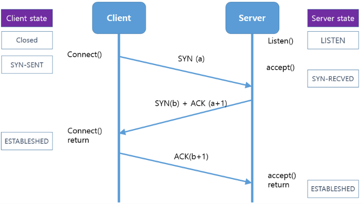

# 3-Way, 4-Way Handshake, 흐름제어

### TCP 3-way Handshake

TCP 프로토콜을 이용해서 통신을 할 때 클라이언트와 서버가 정확한 전송을 보장하기 위해 세션을 수립하는 과정

**State 정보**

- CLOSED : 포트가 닫힌 상태
- LISTEN : 포트가 열린 상태로 연결 요청 대기 중
- SYN_SENT : 연결을 위해 SYN 을 보낸 상태
- SYN_RECIVED : 연결 요청 SYN 을 받은 상태
- ESTABLISHED : 포트 연결 상태

 

**연결 과정**

1. 클라이언트가 연결을 위해 SYN 플래그를 1로 만들고, Sequence Number 에 난수를 세팅 후 전송
2. 서버는 연결 요청에 대해서 SYN, ACK 플래그를 세팅 후 응답, 이때 Sequence Number에 난수를 세팅하고, ACK Number에 클라이언트가 보낸 Sequence Number + 1 을 세팅 후 전송한다
3. 클라이언트는 해당 응답을 받고 ACK 플래그 세팅, ACK Number에 서버의 SYN + 1 을 세팅 후 전송.

해당 과정이 완료되면 클라이언트와 서버 모두 ESTABLESHED 상태가 되며 데이터를 전송할 준비가 완료된다.

 

### TCP 4-way Handshake

4 way handshake 란 TCP 통신 연결을 해제하기 위해 진행되는 과정이다.

통신을 그냥 끊어버리지 않고 4 way handshake 과정을 거치는 이유는 TCP의 신뢰성을 보장하기 위해서다.

통신이 예기치 않게 종료된다면 TCP의 신뢰성에 영향을 줄 수 있기 때문에 연결 종료시 서버와 클라이언트가 서로 연결을 종료할 준비가 되었다는 것을 알려주는 용도라고 할 수 있다.

**Client 상태 정보**

- **`FIN-WAIT-1`** : 서버와 연결을 종료하기 위해 FIN 플래그 세팅 후 패킷을 보내고 그에 대한 응답을 기다리는 상태. 이 때 클라이언트는 더이상 데이터를 보낼 수 없다.
- **`FIN-WAIT-2`** : 서버에서 연결 종료에 대한 응답(ACK)이 오면 이 상태로 전환된다.
- **`TIME-WAIT`** : 서버에서 FIN 요청을 받는다면, 서버의 FIN 응답에 대한 ACK를 전송하고 이 상태로 전환된다. 이때, 서버에 전송된 ACK 에 오류가 있을 수 있기 때문에 MSL 시간만큼 기다린 후 CLOSED 상태로 전환되는 것이다.

**Server 상태 정보**

- **`CLOSE-WAIT`** : 클라이언트에게서 FIN 신호를 받고 그에 대한 응답(ACK)을 한 상태. 이때 서버 측의 애플리케이션에게 클라이언트의 연결 종료를 알린다.
- **`LAST-ACK`** : 서버 측 애플리케이션 종료가 준비되면 FIN 신호를 보낸 후 LAST-ACK 상태로 전환된다.
- **`CLOSED`** : LAST-ACK 상태에서 FIN 신호의 응답이 오면 연결을 종료한다.

 

### TCP 흐름제어

TCP 통신에서 수신 측이 송신 측보다 데이터 처리 속도가 빠르면 문제가 없지만, 송신 측의 속도가 빠를 경우 문제가 생긴다.

수신 측에서 제한된 저장 용량을 초과한 이후에 도착하는 패킷은 손실되기 때문에 불필요한 추가 패킷 요청과 전송이 발생하게 된다.

흐름제어는 송신측과 수신측의 TCP 버퍼 차이로 인해 생기는 데이터 처리 속도 차이를 해결하기 위한 기법이다.

 

**Stop and wait 방식**

- 패킷을 하나 보내고 보낸 패킷에 해당하는 ACK 가 올 때까지 기다리는 방식
- ACK응답이 올때까지 송신자는 계속 기다리기 때문에 굉장히 비효율적이다.

 

**Go-Back-N (슬라이딩 윈도우)**

- 수신측에서 순서대로 받지 못한 패킷이 있다면 해당 패킷부터 다시 재전송하는 방식

### References

[https://sjlim5092.tistory.com/35](https://sjlim5092.tistory.com/35)

[https://jeongkyun-it.tistory.com/180](https://jeongkyun-it.tistory.com/180)

[https://ooeunz.tistory.com/91](https://ooeunz.tistory.com/91)

[https://ddongwon.tistory.com/81](https://ddongwon.tistory.com/81)
