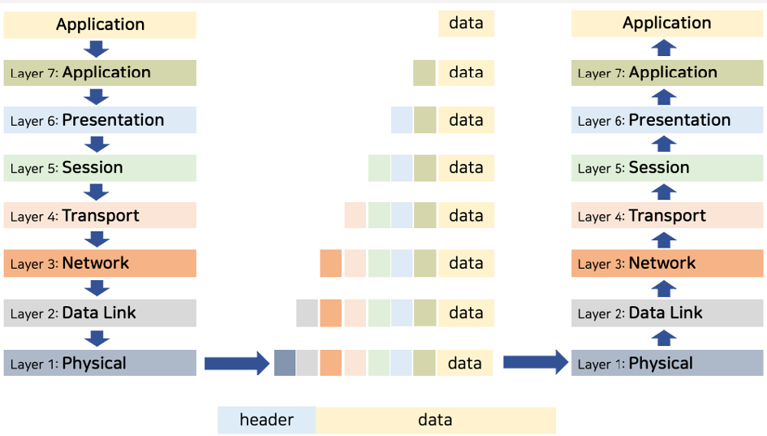

# OSI 7 계층, TCP/IP 모델

### OSI 7 계층 이란?

OSI 7 계층은 ISO(International Organization for Standardization) 에서 정의한 네트워클 프로토콜을 7개의 계층으로 나눈 모델을 말한다.

이 모델은 네트워크에서 데이터를 전송할 때 사용되며, 각 계층은 서로 다른 역할과 책임을 가진다.

**OSI 7 계층**

- 데이터는 header 부분과 data 부분으로 나뉜다.
    - 상위 계층에서 하위 계층으로 내려갈 때는 각 프로토콜마다 header를 추가하는 캡슐화 과정을 거쳐야 한다.
    - 하위 계층에서 상위 계층으로 올라갈 때는 캡슐화된 header 정보를 추출하는 역캡슐화 과정을 거친 후 각 계층에서 필요한 처리를 수행한다.
- 각각의 layer는 반드시 인접한 layer 로만 데이터를 전달할 수 있다.

**물리 계층 - Physical**

- 물리 계층은 데이터를 전기 신호로 변환하여 송수신하는 역할을 담당한다.
- 단지 데이터를 전기적인 신호인 bit 로 변환하여 통신 케이블 등을 통해 주고받는 기능만 한다.
- 전송 단위 : Bit

**데이터 링크 계층 - Data Link**

- 물리 계층을 통해 송수신되는 정보의 오류와 흐름을 관리하여 안전한 통신 흐름을 관리한다.
- 프레임에 물리적 주소인 MAC address 를 부여하고 에러검출, 재전송, 흐름 제어를 수행한다
- 2개의 부 계층으로 구성된다.
    - MAC 계층 : 물리적 부분으로 매체간 연결방식을 제어하고 1계층과 연결된다
    각각의 주소가 48bit 로 구성되어 있으며 이 일련번호는 전세계에서 고유한 일련번호를 가진다.
    - LLC 계층 : 논리적인 부분으로 프레임을 만들고, 3계층인 네트워크와 연결된다

- 전송 단위 : 프레임 (Frame)
- 대표적 프로토콜 : Ethernet
    
    
    

**네트워크 계층 - Network**

- 네트워크 계층은 서로 다른 네트워크를 이동할 때 경로를 찾아주는 역할을 하는 계층.
- 네트워크 계층은 여러 개의 노드를 거칠 때마다 경로를 찾아주는 역할을 한다.
- 다양한 길이의 데이터를 네트워크들을 통해 전달하고, 그 과정에서 Data Link 계층이 요구하는 서비스 품질을 제공하기 위한 기능적, 절차적 수단을 제공한다.

- 전송 단위 : 패킷 (Packet)
- 대표적 프로토콜 : IP

**전송 계층 - Transport**

- 전송 계층은 애플리케이션 계층과 네트워크 계층 사이에 존재하는 네트워크 구조의 핵심 역할을 하는 계층
- 양 끝단의 사용자들이 신뢰성 있는 데이터를 주고받도록 해준다.
- end-to-end 시스템에서만 구현된다
    - 중간에 있는 라우터가 아닌 Host 에서 구현

- 전송 단위 : 세그먼트
- 대표적 프로토콜 : TCP

**세션 계층 - Session**

- 세션 별로 데이터 송수신이 가능하도록 하는 계층
- FTP 프로그램을 생각해보자
    - 특정 파일을 다운로드 해 놓고 다운로드 진행 중 다른 파일을 다운 받거나 업로드 할 수 있음
    - 이것들이 별도의 세션, 실제적으로는 하나의 데이터망에서 전송이 되는데, 이를 논리적으로 구분해서 여러 세션이 개별적으로 동작할 수 있는 처리를 담당한다.

**프레젠테이션 계층 - Presentation**

각 애플리케이션들의 정보를 서로 잘 통신할 수 있도록 필터하고 변환하는 층

- 사실상 암호화를 담당한다.
- 응용계층으로부터 전달받거나, 전달하는 데이터의 암호화, 데이터 압축을 수행한다.

**응용  계층 - Application**

- OSI 모델에서 유저와 가장 가까운 층
- 사용자에게 서비스를 제공하고 사용자가 제공한 정보나 명령을 하위계층으로 전달하는 역할을 수행한다.

- 대표적 프로토콜 : HTTP, SMTP, POP, SNMP, WWW 등

### TCP / IP 모델

**OSI 7 계층 모델과의 차이점**

OSI 7 계층 은 일종의 참조모델로 레이어마다 이런 역할을 했으면 좋겠다 라는 것을 모델로 정의한 것으로 실제 동작과는 차이가 있다.

실제 네트워크가 동작하는 과정은 TCP/IP 모델을 따른다.

**TCP / IP 모델이란?**

- OSI 모델이 탄생하기 전부터 미국 국방부에서 개발된 프로토콜
- 인터넷 통신을 위한 모델
- TCP/IP 모델의 응용 계층은 OSI모델의 세션 + 표현 + 응용 계층 통합

**TCP / IP 프로토콜**

**TCP 프로토콜**

- 연결 지향 프로토콜 : 3 Way Handshake, 4 Way Handshake
- 신뢰성 있는 전송 : Sequence Number와 Acknowledgement Number 를 사용
- 흐름 제어 : 송수신지 간에 전송되는 데이터 전송량을 제어
- Packet Recovery : 데이터 전송 과정에서 패킷 손실을 복구하는 기능

**IP 프로토콜**

- 목적지 주소지로 패킷을 전송
- 하나의 데이터도 여러 개의 패킷으로 나누어질 수 있다
- 각 패킷은 필요에 따라 서로 다른 경로로 보내질 수 있다
- IP 프로토콜은 패킷 전달만 수행한다
- 순서 정렬은 상위 프로토콜인 TCP 가 수행
