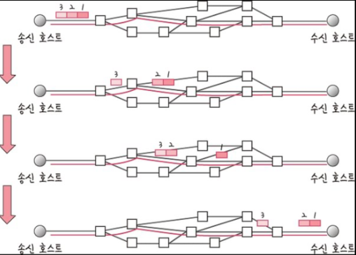

# TCP / UDP

## TCP 프로토콜

---

### TCP 프로토콜이란?

- 연결형 서비스로 가상 회선 방식을 사용한다
- 흐름제어, 오류제어, 혼잡제어를 제공한다
- 데이터 재조립을 제공해 높은 신뢰성을 보장한다.
- 프로토콜의 데이터 단위 (PDU) : Segment

 

**가상회선 패킷 교환 방식**

가상회선 패킷 교환 방식은 각 패킷에 가상회선 식별자가 포함되며 모든 패킷을 전송하면 가상 회선이 해제되고 패킷들은 전송된 “**순서대로**” 도착하는 방식을 말한다.

 

### TCP 프로토콜의 헤더

TCP 프로토콜의 헤더는 `20 bytes`, `160 bits`의 헤더를 사용한다.

하지만 `20 bytes` 는 아무런 옵션도 없는 기본적인 헤더일 때의 용량이고 TCP의 여러 옵션들을 사용하게 되면 맨 뒤에 옵션 필드들이 추가로 붙기 때문에 최대 `40 bytes`가 더해진 `60 bytes`까지도 사용할 수 있다.

 

**Source port, Destination port**

- 세그먼트의 출발지와 목적지를 나타내는 필드로, 각각 16 bits를 할당받는다.
- port 로 할당된 비트수가 최대 16 bits 이기 때문에 포트번호는 최대 2^16 만큼 존재할 수 있는 것
- 출발지와 목적지의 주소를 판별하기 위해서는 `IP 주소`와 `포트 번호`가 필요하다. IP주소는 네트워크 계층에 있는 IP의 헤더에 담기기 때문에 TCP 헤더에는 IP주소를 나타내는 필드가 없고 포트를 나타내는 필드만 존재한다.

 

**Sequence Number**

- 시퀀스 번호는 전송하는 데이터의 순서를 의미한다.
- 32 bits를 할당받고 있고, 최대 `4,294,967,296`까지의 수를 담을 수 있다.
- 송신자가 최초로 데이터를 전송할 때는 이 번호를 랜덤한 수로 초기화 하며, 이후 자신이 보낼 데이터의 1 bytes당 시퀀스 번호를 1씩 증가시키면서 데이터의 순서를 표현한다.
  - 왜 랜덤한 수로? → 모든 시퀀스 번호가 0부터 시작할 때 해킹에 취약할 수 있고, port 가 재활용되면서 시퀀스 넘버가 중복되어 문제가 발생할 수 있기 때문

 

**Acknowledgment Number (if ACK set)**

- ACK 번호는 데이터를 받은 수신자가 예상하는 다음 시퀀스 번호를 의미한다.
- 다음 시퀀스 번호를 의미하기 때문에 Sequence Number와 같은 32 bits를 할당받는다.
- 데이터를 주고받을 때는 `상대방이 보낸 Seqence Number + 받은 데이터의 bytes`로 ACK 번호를 만든다.
- 따라서 ACK 번호는 송신측이 다음에 보내줘야하는 데이터의 시작점을 의미한다.

 

**Data offset**

- 전체 세그먼트 중에서 헤더가 아닌 데이터가 시작되는 위치를 표시한다.
- 이 오프셋을 표기할 때는 `32 bit word`단위를 사용하기 때문에 이 필드의 값에 4를 곱하면 세그먼트에서 헤더를 제외한 실제 데이터의 시작 위치를 알 수 있다.
- 4 bits를 할당받고 있기 때문에 0 ~ 15 word 까지 표현이 가능하다. 때문에 TCP 헤더의 최대 길이는 15 \* 4 bytes 인 60 bytes 까지가 가능하다.
  - TCP 헤더의 필수 길이는 20 bytes 이기 때문에 offset은 최소 5 word 로 고정되어 있다.

 

**Reserved**

- 미래를 위해 예약된 필드로, 모두 0으로 채워져야 한다.
- 딱히 용도가 없음.
- 3 bits 할당

 

**Flags (NS ~ FIN)**

- 9개의 비트 플래그로 현재 세그먼트의 속성을 나타낸다.
- 기존에는 6개의 플래그만을 사용했지만, 혼잡 제어 기능의 향상을 위해 `Reserved` 필드를 사용하여 `NS, CWR, ECE`플래그가 추가되었다.

- **URG** : `Urgent Pointer (긴급 포인터)` 필드에 값이 채워져있음을 알리는 플래그로 이 포인터가 가리키는 긴급한 데이터는 먼저 처리된다. 요즘에는 많이 사용하지 않음
- **ACK** : `Acknowledgmemt (승인번호)` 필드에 값이 채워져있음을 알리는 플래그. 이 필드가 0이라면 승인번호 필드 자체가 무시된다.
- **PSH** : `push 플래그`. 수신측에게 데이터를 최대한 빠르게 응용 프로그램에 전달해달라는 플래그.
- **RST** : `Reset 플래그.` 이미 연결이 확립되어 `ESTABLISHED`상태인 상대방에게 연결을 강제로 리셋해달라는 요청의 플래그
- **SYN** : `Synchronize 플래그.` 상대방과 연결을 생성할 때, 시퀀스 번호의 동기화를 맞추기 위한 세그먼트임을 의미한다.
- **FIN** : `Finish 플래그.` 상대방과 연결을 종료하고 싶다는 요청인 세그먼트임을 의미한다.

새롭게 추가된 NS, CWR, ECE 플래그는 `네트워크의 명시적 혼잡통보(ECN)`를 위한 플래그이다.

기존에 네트워크 혼잡 상황 인지 방법은 타임아웃을 이용한 방법이었는데, 처리속도에 민감한 애플리케이션에서는 이런 대기시간조차 아깝기 때문에 네트워크 혼잡 상황을 명시적으로 알리기 위해 해당 플래그를 이용하여 혼잡 상태를 알린다.

 

**Window Size**

- 한 번에 전송할 수 있는 데이터의 양을 의미하는 값을 담는다.
- 16 bits를 할당받는다.

 

**Checksum**

- 데이터를 송신하는 중에 발생할 수 있는 오류를 검출하기 위한 값이다.
- Checksum 계산과정 간단히
  - pseudo header를 생성한다 - [src ip + dest ip + reserved + protocol + tcp 길이]
  - pseudo header 의 16 bit 단위 합을 구한다 (warp around 적용) - A라고 하자
  - TCP Segment의 Header와 Data에 대한 16비트 단위 합을 구한다 (warp around) - B라고 하자
  - A + B의 값의 결과에 1의 보수 (비트반전) 을 적용하여 체크섬 계산을 완료한다.
- 수신측에서 checksum 계산 과정의 알고리즘에서 구한 값에 checksum 필드의 값을 비교하여 데이터의 오류가 발생했는지 여부를 알 수 있다.

 

**Urgent Pointer**

- 긴급 포인터. URG 플래그가 1이라면 이 포인터가 가리키는 데이터를 우선 처리한다.

 

**Options**

- TCP의 기능을 확장할 때 사용하는 필드들이다.
- 필드의 크기가 고정된 것이 아니라 가변적이다.
- 대표적 옵션
  - WSCALE - 윈도우 사이즈의 최대 값 표현을 확장한다.
  - SACK - Selective Repeat 방식을 사용하기 위한 필드
- 이 외에도 30개 정도의 옵션을 사용할 수 있다.

 

### 정리

다시한번 TCP 헤더를 보면서 어떤 필드가 있는지 정리해보자.

 
 

## UDP 프로토콜

---

### UDP 프로토콜 이란?

- 비연결형 서비스로 데이터그램 패킷 교환 방식을 사용한다.
- 데이터그램이란 UDP 프로토콜의 데이터 단위(PDU)로 독립적인 관계를 지니는 패킷이라는 뜻이다.
- MTU(Maximum Transimission Unit) 크기를 초과할 경우에는 단편화되어 전송되며 재조립은 IP헤더의 identification 필드를 이용해 이루어진다.

 

**데이터그램 패킷 교환 방식**

- 데이터를 전송하기 전에 논리적 연결이 설정되지 않으며 패킷이 독립적으로 전송된다.
- 패킷을 수신한 라우터는 최적의 경로를 선택하여 패킷을 전송하는데 하나의 메시지에 분할된 여러 패킷은 서로 다른 경로로 전송될 수 있다.
- 송신 측에서 전송한 순서와 수신 측에 도착한 순서가 다를 수 있다.

 

### UDP 프로토콜의 헤더

**Source port, Destination port**

- 송신측과 수신측의 port 번호를 나타낸다.
- 16 bits 씩 할당되어 있다.

 

**Length**

- 헤더와 데이터를 합한 사용자 데이터그램의 전체 길이를 정의한다.

 

**checksum**

- 헤더와 데이터를 모두 포함한 사용자 데이터그램 전체에 대해 오류를 탐지하기 위해 사용된다.
- checksum 은 오류를 검출하고 데이터를 다시 받기 위해 존재하는 것이 아니라 오류가 검출되면 데이터를 그냥 폐기해버리기 위해 존재한다.

 

### TCP 와 UDP 의 비교

 

### 예상 면접 문항

1.  TCP와 UDP의 차이점과 장단점에 대해서 설명해주세요.

1.  채팅 서버-클라이언트간에는 TCP와 UDP중 어떤 프로토콜을 사용하는 것이 좋을지에 대해 가능한 구체적으로 설명해주세요.
