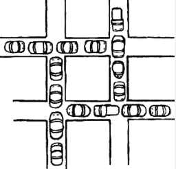

# 데드락(교착상태)

## 정의

2개 이상의 사용자가 서로를 가로막아 정지된 상태

멀티 프로세스, 멀티 스레드 환경에서 하나의 공유 자원에 대해 서로의 자원을 가진 상태로 내가 먼저 쓰겠다고 우기면서 배째는 상황

⇒ 이런 상황이 일어나려면 공유 자원의 접근에 대한 제한이 있어야 데드락이 일어날 수 있다.

- 만약 아무런 제한 없이 공유 자원에 접근할 수 있다면?
  ⇒ 그냥 ERROR or EXCEPTION or 데이터 파손이 일어나고 끝
  ⇒ 근데 내가 공유 자원을 사용할 때 뭔가 조치를 위했고, 이러한 조치 때문에 무한루프에서 벗어날 수 없는 상황이 발생 ⇒ 데드락

⇒ 예시 :

git을 사용해서 프로젝트를 하고 있을 때, solution.java파일과 userSolution.java파일을 나와 내 친구가 동시에 수정 해야 한다.

일단 나는 solution 파일을 사용하고, 친구는 userSolution파일을 사용한다.

이때 고집이 강한 두 사람은 서로 먼저 사용 하겠다고 우기면서 자기가 수정한 파일을 push 하지 않고, 서로 push 할 때까지 기다린다.

누군가는 먼저 push를 해야 그걸 받아서 나머지 작업을 하는데, 서로가 배를 째는 상황이고, 서로 집에서 작업중이기 때문에 상대를 제압해서 강제로 push할 수도 없다.

⇒ 교착상태

## 발생 조건

이러한 상황은 쉽게 일어나지 않는다.

1. 멀티 프로세스, 멀티 스레드 환경일 것 (

   ⇒ 만약 자원의 사용자가 하나라면 이러한 교착상태가 발생할 이유가 없다. 알고리즘 문제 풀다가 교착상태가 발생할 일이 없는 것 처럼.

2. 4가지 조건

   1. 상호 배제 ( Mutual exclusion )

   - 자원은 동시에 사용할 수 없다.
     - ex ) git에서 같은 파일을 동시에 작업하면 서로의 변경 점이 충돌을 일으키기 때문에 동시 작업을 막는다.
     - ⇒ 이처럼 멀티 프로세스, 멀티 스레드에서는 의식적으로 공유 자원에 다수의 사용에 대한 처리가 필요하다.

   1. 점유 대기 ( Hold and wait )

   - 하나 이상의 자원을 가지고 있으면서
   - (다른 사용자가 사용하고 있는)다른 자원을 차지하기 위해 대기 중인 프로세스가 있어야 한다.
     - ex ) 내가 Solution.java파일을 차지하고 있으면서, userSolution파일을 차지하기 위해 기다리고 있는 상황.
     - ⇒ 그냥 기다리는 상황이 아닌, 다른 프로세스가 필요로 하는 자원을 “가진” 상태에서 대기 중이어야 한다.

   1. 비선점 ( Non - preemption )

   - 다른 프로세스의 자원을 강제로 빼앗을 수 없다.
     - ex ) 하필이면 집에서 작업 중이기 때문에, 찾아가서 강제로 push하게 할 수가 없다.
     - ⇒ 프로세스 간에 서로 강제로 자원을 빼앗을 수 없어야 한다.

   1. 순환 대기 ( Circular wait )

   - 프로세스의 집합에서 순환 형태로 자원을 대기하고 있어야 한다.
     - ex ) 나는 userSolution 파일이, 내 친구는 Solution 파일이 필요하고, 서로가 가지고 있는 순환적인 상황.
     - ⇒ 2개 이상의 프로세스가 서로를 기다리는 순환적인 상태여야 한다.

   ## 데드락 해결 방법

   ### 1. 예방 ( prevention )

   - 교착상태가 아예 일어나지 않게 “시스템을 설계”하는 것
   - 4가지 방법 중 하나를 부정해서 데드락의 발생을 예방한다.

     - 상호배제(Mutual Exclusion) 부정
       - 자원에 동시에 들어갈 수 있게 한다.
         ⇒ 서로 다른 방식으로 자원 할당? or 같이 사용해도 자원에 문제 X
       - 사실상 힘들기 때문에 잘 쓰이지 않음
       - ex ) 친구가 userSolution파일을 push하지 않았지만, 그냥 나도 사용해야겠다. 충돌나도 뭐 어쩔 수 없지?
     - 점유대기(Hold and Wait) 부정
       - 자원을 가진 상태에서, 다른 자원을 기다리는 것을 막는다.
         - 모든 요구 자원을 한번에 할당해서 hold 상태가 생기지 않게 만든다.
         - wait해야 하는 상황에서는 자원을 반납하고, 다른 일을 하고 있는다.
           - 자원의 효율적인 사용이 힘들다. + context Switching이 자주 일어날 수 있다.
           - 우선순위가 각 프로세스 별로 같아야 의미가 있다. 다르면 X
       - ex ) 친구와 userSolution과 Solution을 동시에 건들고, 남은 사람은 기다리기로 약속한다. / 한명이 push하고 다른 일을 하고 있는다.
     - 비선점(Non-Preemption) 부정

       - 다른 프로세스의 자원을 강제로 빼앗을 수 있게 한다.
         - 각 프로세스에 우선순위를 할당하여 우선순위에 따라 자원을 빼앗을 수 있게 한다.
           - 운영체제의 프로세스 스케줄링이 대표적인 예시
           - 그러나 일반적인 프로그램에서는 우선순위 알고리즘에 자원을 사용하기 때문에 잘 사용하지 않는다.
       - ex ) 변호사를 고용해서 나와 친구 중에 누가 먼저 작업할 것인지 판정을 맡긴다.

     - 순환 대기 ( Circular wait ) 부정
       - 각 자원에 번호를 할당하고, 각 프로세스가 자원을 요구할 때 이 번호에 따라 요구하는 자원의 순서를 결정
         - 자원 사용 순서를 지정해서, 선형적인 자료구조를 만든다.
         - 특정한 상황에서만 사용 가능 + 거대한 시스템에서 순서를 정하는 것은 힘든 일
       - ex ) 친구와 내가 교착상태에 빠졌으니 협업하기 전에 만든 알고리즘을 통해 1번인 내가 먼저 자원을 할당받는다. 2번인 너는 나 다음에 한다.

   예방은 단순히 시스템의 설계에서 데드락 상황을 예측하고, 데드락이 일어나지 않게 설계하는 것을 말한다.

### 2. 회피 **(avoidance)**

- 시스템이 데드락 상태에 빠지지 않도록 하기 위해
- 프로세스들의 자원 요구를 승인할 때마다 시스템이 안전하게 실행될 수 있는 지를 검사하여
- 데드락 상태에 빠질 가능성이 있는 경우 자원 할당을 거부하는 방법
  - 자원 할당 그래프 사용 , 은행원 알고리즘 → 자세한 설명은 생략
    - 그래프를 그리면서 자원을 할당하면 cycle이 생기는 case를 추적하여 할당하지 않는다.
    - 운영체제가 각 프로세스가 자원을 요청할 때마다, 해당 자원이 다른 프로세스에 할당될 경우 데드락이 발생하는 지를 미리 검사

단점

- 그래프 사용의 비용 ( 자원, 시간 )
- 회피 방법이기 때문에 이미 발생하면 다른 방법을 이용해야 함
- 운영체제의 실시간 모니터링 (부하)
- 사이클 생성 시 할당하지 않는 것 → 자원 효율 낮음

ex ) 실시간으로 사용자가 파일에 접근하는 것을 추적하고, 나와 내 친구처럼 2가지 파일을 서로 사용하려고 서버에 요청 데이터를 보냈다. 서버는 요청 데이터를 시뮬레이션 해보고, 순환 (cycle) 상태가 발생한다고 판단하여 클라이언트 (나 or 친구)에게 접근 거부 메시지를 보낸다.

### 3. 데드락 탐지 & 회복 ( Detection & Recovery )

1. 탐지 ( Detection )

   - 자원 할당 그래프와 비슷한 방식으로 “데드락이 발생했는지”를 확인 ( 회피에서는 예측해서 막는다면, 탐지에서는 방치 한 후 탐지 )
   - 자원 할당 그래프, 은행원 알고리즘, 자원 상태 검사 알고리즘, 상호배제 검사, 점유대기검사, 비선점 검사 등등…

   탐지 자체는 회피와 비슷한 알고리즘으로 돌아간다. 왜냐하면 회피는 특정 상황을 시뮬레이션 해봐서 데드락이 일어나는 상황임을 예측하는 것이고, 탐지는 일어난 상황을 찾는 것이기 때문이다. 다만 방법이 같기에 알고리즘의 이름이 같으나, 목적과 의도가 다르다.

   ex ) 실시간으로 사용자가 파일에 접근하는 것을 추적하고, 나와 내 친구처럼 2가지 파일을 서로 사용하려고 서버에 요청 데이터를 보냈다. 서버는 허용했고, 나와 친구 사이에는 데드락이 발생했다. 서버에서는 이를 실시간으로 탐지했다. (해결은 혼자 못함)

   → 탐지와 회피는 복합접으로 사용된다.

   → 보통 따로 구현하지만, 특정 시스템에서는 탐지와 회피를 같이 구현해서 사용할 수도 있다.

2. 회복 ( Recovery )
   - 강제 종료 (Aborting)
     - 데드락에 걸린 프로세서를 강제로 종료 시킨다. ( 운영체제에 기본적으로 제공되는 방법 )
     - 비용이 저렴 / 결과 데이터 일부 손실 가능성
     - ex ) 나와 친구가 데드락에 걸렸으니, 컴퓨터를 둘 다 꺼버린다.
   - 롤백 (Rollback)
     - 트랜잭션에서 이전 상태로 복원
     - 데이터 무결성을 보장하면서 데드락을 해결할 수 있는 효과적인 방법 중 하나
     - ex ) 나와 친구가 데드락에 걸렸으니, 둘 다 자료를 수정하기 전 상태로 되돌린다. 작업을 다시 해야 하지만, 일단 데드락은 풀렸다.
   - 선행 순서 (Preemption)
     - 우선순위가 낮은 프로세스의 자원을 회수하여 다른 프로세스에게 할당하는 방법
     - ex ) 내가 우선순위가 높으니, 친구의 userSolution을 회수하여 나에게 할당한다.
   - 자원 할당 취소 (Resource Allocation Release)
     - 자원 할당 그래프를 기반으로 데드락을 탐지하고, 데드락을 일으키는 자원을 회수하여 다른 프로세스에게 할당하는 방법
     - ex ) 실시간으로 서버에서 데드락을 탐지해서, 친구의 userSolution을 회수하고, 나에게 할당한다.
