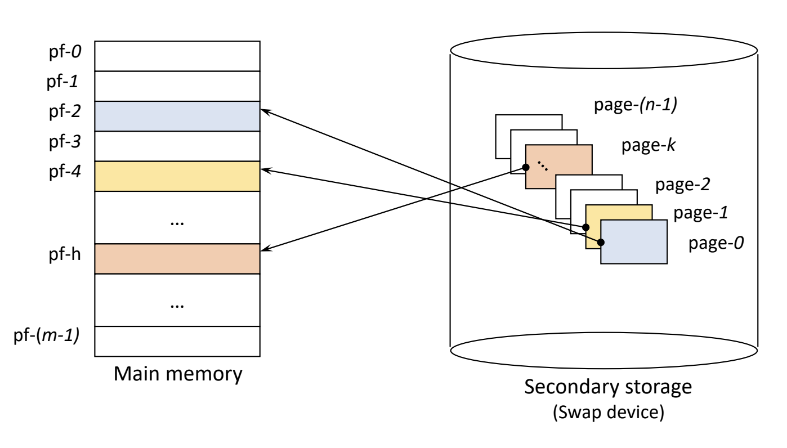

# 가상 메모리 (1)

### 2023.06 4주차

## Paging System

### Page

: 프로세스를 같은 크기로 분할한 block (가상 메모리)

$\Leftrightarrow$ Segment : block의 크기가 서로 다를 수 있음

- Frame
  - 메모리의 분할 영역 (물리 메모리)
  - Page와 같은 크기로 분할

- 특징
  - 논리적 분할이 아님 (크기에 따른 분할)
  - Page 공유 및 보호 과정이 복잡함 (Segmentation 대비)
  - 간단하고 효율적 (Segmentation 대비)
  - 외부 단편화(external fragmentation) 발생 안함
  - 내부 단편화(internal fragmentation) 발생 가능

### Address Mapping

- Virtual address : v = (p, d)

  - p : page number
  - d : diaplacement(offset)

- PMT (Page Map Table) 사용

### Direct mapping

Block mapping 방법과 유사

- 가정

  - PMT를 커널 안에 저장
  - PMT entry size = entrySize (1개 행, 줄)
  - Page size = PageSize

- 과정

  1. 해당 프로세스의 PMT가 저장되어 있는 주소 b에 접근
  2. 해당 PMT에서 page p에 대한 entry 찾음
     - p의 entry 위치 = b + p \* entrySize
  3. 찾은 entry의 residence bit 검사

     3.1 Residence bit = 0인 경우 (`page fault`)

     - swap device에서 해당 page를 메모리에 적재
     - PMT 갱신 후 3.2 실행

       3.2 Residence bit = 1인 경우

     - 해당 entry에서 page frame 번호 p’ 확인

  4. pf와 가상 주소의 변위 d를 사용하여 실제 주소 r 형성
     - r = p’ \* pageSize + d
  5. 실제 주소 r로 주기억 장치에 접근

- page fault
  - entry를 disk I/O (swap device)에서 꺼내서 적재해야함
  - 스케줄링에서 ready 상태에서 blocked 상태로 변경 (Context Switching, `높은 overhead`)

- 문제점

  - 메모리 접근 횟수가 2배 → 성능 저하 (performance degradation)
  - PMT를 위한 메모리 공간 필요

- 해결 방안
  - Associative mapping (TLB)
  - PMT를 위한 전용 기억장치 사용 → dedicated register or cache memory
  - Hierarchical paging
  - Hashed page Table
  - Inverted page Table

### Associative Mapping

- TLB(Translation Look-aside Buffer)에 PMT 적재
  - Associative high-speed memory (HW 장치)
- PMT를 병렬 탐색
- 적은 overhead, 높은 스피드
- Expensive HW (큰 PMT를 다루기 어려움)

### Hybrid Direct / Associative Mapping

- 두 기법을 혼합

  - HW(TLB) 비용은 줄이고 Associative Mapping의 장점 활용

- 작은 TLB 사용

  - PMT : 메모리(커널 공간)에 저장
  - TLB : PMT 중 일부 entry들을 적재

    - 최근에 사용된 page들에 대한 entry 저장 → locality 활용

  - Locality (지역성) 활용
    - 프로그램의 수행 과정에서 한 번 접근한 영역을 다시 접근(temporal locality) 또는 인접 영역을 다신 접근(spatial locality)할 가능성이 높음

- 과정
  - 프로세스의 PMT가 TLB에 적재되어 있는지 확인
    1. TLB에 적재되어 있는 경우
       - residence bit를 검사하고 page frame 번호 확인
    2. TLB에 적재되어 있지 않은 경우
       - direct mapping으로 page frame 번호 확인
       - 해당 PMT entry를 TLB에 적재

## 출처

[운영체제 강의 모음 (슬라이드 & YouTube 링크)](https://hpclab.tistory.com/1?category=887083)
