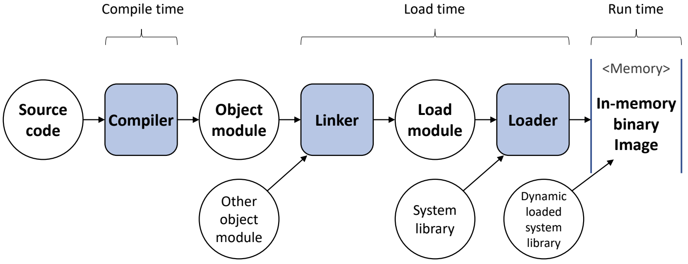

# 메모리 관리 (2)

- binding은 (프로그램 크기 < 메모리 크기)를 가정한 것

## Dynamic Loading

: 모든 루틴(함수)을 교체 가능한 형태로 디스크(보조 메모리)에 저장하고, 메모리에 올라가 있는 주 프로그램이 해당 루틴을 호출한 시기에 주 메모리에 적재 (relocatable linking loader, 재배치 가능 연결 적재기를 사용)

- 실제 호출 전까지 루틴을 적재하지 않음 → 장점) 메모리 공간의 효율적 사용
- 메인 프로그램만 메모리에 적재해 수행
- 루틴의 호출 시점에 runtime binding

# Memory Allocation

## Continuous Memory Allocation (연속 할당)

: 프로세스를 하나의 연속된 메모리 공간에 할당하는 정책

## Uni programming

: 하나의 프로세스만 메모리 상에 존재, 가장 간단한 메모리 관리 기법

<code>💡 문제점 : 프로그램 크기 > 메모리 크기 </code>

### Overlay Structure

: 메모리에 현재 필요한 영역만 적재

- 사용자가 프로그램의 흐름 및 자료구조를 모두 알고 있어야 함
- 공통된 부분만 적재하고 필요할 때마다 pass 1과 pass 2를 적재하여 사용

<code>💡 커널 보호 </code>

### Boundary register

: 경계 레지스터 위로 할당을 못 받도록 주소를 지정하는 것

## Multi programming

- 메모리에 하나만 올라가는(Uni programming) 문제
  - Low system resource utilization
  - Low system performance

### Fixed Partition Multi programming (FPM)

: 고정 분할

- 메모리 공간을 고정된 크기로 분할 (미리 분할되어 있음)
- 각 프로세스는 하나의 분할에 적재
- 분할(partition)의 수 = multi programming degree (메모리에 동시에 올라갈 수 있는 프로세스 수)

- Uni programming과 마찬가지로 Boundary register가 존재

  → partition 별로 존재해서 각각을 보호

### Fragmentation (단편화)

- Internal fragmentation (내부 단편화)

  - Partition 크기 > Process 크기 → 한 partition 내에서 메모리 낭비되는 현상

  예) Process 1 : 10MB, Process 2 : 9MB, Process 3 : 5MB 낭비

- External fragmentation (외부 단편화)
  - (남은 메모리 크키 > Process 크기)이지만 연속된 공간이 아님 → 메모리 낭비되는 현상
  예) 남은 메모리 44MB > Process 4(30 MB)가 새로 들어올 예정

- 요약
  - 고정된 크기로 메모리 미리 분할
  - 메모리 관리가 간편함
  - 내부/외부 단편화 발생 가능 → 시스템 자원이 낭비

### Variable Partition Multi programming (VPM)

: 가변 분할

- 초기에는 전체가 하나의 영역
- 프로세스를 처리하는 과정에서 메모리 공간이 동적으로 분할

  ⇒ 내부 단편화가 발생하지 않는다

- VPM 예시
  - 전제 메모리는 120MB로 가정
  - 커널 바로 밑의 주소는 u라고 가정

1. 프로세스 A, B, C, D 적재

2. 프로세스 E 적재, 프로세스 B, D 주 기억 장치 반납

<code>💡 이 상황에서 크기가 5MB인 프로세스를 적재할 때 어디에 적재할 것인가? </code>

## 배치 전략 (Placement Strategies)

### First-fit (최초 적합)

- 충분한 크기를 가진 첫 번째 partition을 선택
- 간단하고 적은 오버헤드 발생
- 공간 활용률이 떨어질 수 있음
  예) 남은 공간이 6MB인 partition에 적재 → 1MB 낭비
  예) 남은 공간이 50MB인 partition에 적재 → 다음 프로세스의 크기가 45MB 이상일 경우

### Best-fit (최적 적합)

- 프로세스가 들어갈 수 있는 partition 중 가장 작은 곳을 선택
- 장점
  - 크기가 큰 partition을 유지할 수 있음
- 단점
  - 모든 partition을 검색 → 탐색 시간이 오래 걸린다 (큰 overhead 발생)
  - (활용하기 너무) 작은 크기의 partition이 많이 발생

### Worst-fit (최악 적합)

- 프로세스가 들어갈 수 있는 partition 중 가장 큰 곳을 선택
- 장점
  - 작은 크기의 partition 발생을 줄일 수 있음
- 단점
  - 모든 partition을 검색 → 탐색 시간이 오래 걸린다 (큰 overhead 발생)
  - 큰 크기의 partition 확보가 어려움

### Next-fit (순차 최초 적합)

- 최초 적합 전략과 비슷
- State table에서 마지막으로 탐색한 위치부터 탐색
- 메모리 영역의 사용 빈도 균등화
- 적은 overhead 발생

<code>💡 현재 있는 공간보다 큰 공간을 필요로 하는 프로세스가 들어온다면? → External fragmentation issue </code>

예) 크기가 50MB인 프로세스가 들어온다면?

### Coalescing holes (공간 통합)

- 인접한 빈 영역을 하나의 partition으로 통합
  - 프로세스가 주 메모리를 반납하고 나면 수행
  - 적은 overhead 발생

### Storage Compaction (메모리 압축)

- 모든 빈 공간을 하나로 통합
- 프로세스 처리에 필요한 적재 공간 확보가 필요할 때 수행
- 높은 overhead 발생
  - 프로세스 중지 → 모든 프로세스 재배치
  - 많은 시스템 자원을 소비

## 출처

[운영체제 강의 모음 (슬라이드 & YouTube 링크)](https://hpclab.tistory.com/1?category=887083)

[Dynamic Linking vs. Dynamic Loading | Baeldung on Computer Science](https://www.baeldung.com/cs/dynamic-linking-vs-dynamic-loading)

[Dynamic loading vs. dynamic linking](https://www.educative.io/answers/dynamic-loading-vs-dynamic-linking)

[CS-study/OS at main · hongcheol/CS-study](https://github.com/hongcheol/CS-study/tree/main/OS#주-메모리와-가상-메모리)
