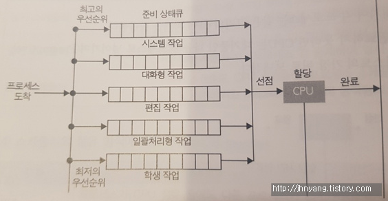

# 스케줄링

### 2023.04월 01주차

## 프로세스 스케줄링

: Multiprogramming 환경에서 CPU를 효율적으로 활용하기 위한 작업

: 실행할 프로세스 중에서 어떤 프로세스를 먼저 실행할지 결정하는 것

### 프로세스 상태

### 프로세스의 상태 전이

- Admitted(승인) : 프로세스 생성이 가능하여 승인됨
- Scheduler Dispatch : 준비 상태에 있는 프로세스 중 하나를 선택하여 실행시키는 것
- Interrupt : 예외, 입출력, 이벤트 등이 발생하여 현재 실행 중인 프로세스를 준비 상태로 바꾸고, 해당 작업을 먼저 처리하는 것
- I/O or Event wait : 실행 중인 프로세스가 입출력이나 이벤트를 처리해야 하는 경우, 입출력/이벤트가 모두 끝날 때까지 대기 상태로 만드는 것
- I/O or Event Completion : 입출력/이벤트가 끝난 프로세스를 준비 상태로 전환하여 스케줄러에 의해 선택될 수 있도록 만드는 것

### 스케줄링 큐

- Ready Queue
  - 프로세스가 시스템에 들어오면 Ready Queue에 들어가서 CPU 코어에서 실행 대기
  - Linked List 형태로 저장되며, Ready Queue의 header는 list의 첫번째 PCB를 가리키고, 각 PCB의 포인터는 Ready Queue에 있는 다음 PCB를 가리킴
- Wait Queue
  - I/O 요청과 같은 특정 이벤트가 처리 완료되기를 기다리는 프로세스가 wait queue에 배치
  - 프로세스는 waiting 상태에서 ready 상태로 바뀌면 ready queue에 들어감S

프로세스는 종료될 때까지 위의 Queueing diagram을 반복하고, 종료되면 모든 큐에서 제거되고 PCB 및 자원 할당이 해제

## CPU 스케줄링 (Scheduling)

: 작업을 처리하기 위해 프로세스들에게 CPU나 각종 처리기들을 할당하기 위한 정책을 계획하는 것

: Ready Queue에 있는 프로세스들을 대상으로 이루어짐

: 최고의 성능을 내기 위해 자원을 어떤 프로세스에게 얼마나 할당할지 계획하는 것

### 프로세스 스케줄링 vs CPU 스케줄링

|           | 프로세스 스케줄링       | CPU 스케줄링                          |
| --------- | ----------------------- | ------------------------------------- |
| 결정 사항 | 실행할 프로세스         | 선택된 프로세스가 CPU를 사용하는 시간 |
| 목적      | 시스템 전반의 성능 향상 | CPU 사용량 최대화 & 응답 시간 최소화  |

### CPU 스케줄링 기준

1. 시스템 입장에서의 성능 기준
   - CPU utilization (CPU 이용률)
     
     : CPU가 사용되는 정도
   - Throughput (처리량)
     
     : 단위 시간 당 완료된 프로세스의 개수 (작업량)
2. 프로그램 입장에서의 성능 기준
   - Response time (응답 시간)
     
     : 작업이 처음 실행되기까지 걸린 시간
     
     : 대화식 (interactive) 시스템을 위한 기준
   - Turnaround time (총 처리 시간)
     
     : 실행 시간과 대기 시간을 모두 합한 시간으로 작업이 완료될 때 까지 걸린 시간
     
     : 준비 완료 큐에서 대기한 시간, CPU에서 실행하는 시간, 입/출력 시간 등 포함
     
     : 한 프로세스를 실행하는데 소요되는 시간
     → (프로세스 완료 시간) - (프로세스 제출 시간)
   - Waiting time (대기 시간)
     
     : 프로세스가 준비 완료 큐에서 대기하면서 보낸 시간의 합

### CPU 스케줄링 목적

- 일반 시스템에서 가지는 공통 목적

  - No starvation : 각각의 프로세스들이 오랜 시간 동안 CPU를 할당받지 못하는 상황이 없도록
  - Fairness : 각각의 프로세스에 공평하게 CPU 할당
  - Balance : Keeping all parts of the system busy

- Batch System (일괄 처리 시스템)

  : 요청이 발생했을 때, 즉각적으로 처리하는 것이 아닌 일정 기간 또는 일정량을 모아뒀다가 한 번에 처리하는 방식

  - CPU utilization : CPU가 쉬는 시간이 없도록
  - Throughput : 시간 당 최대의 작업량
  - Turnaround time : 프로세스의 생성부터 소멸까지의 시간을 최소화
  - 가능하면 많은 일을 수행 (시간[time] 보다 처리량[throughout]이 중요)

- Interactive System (대화형 시스템)

  : 일에 대한 요청에 대해 즉각적으로 응답 받을 수 있는 시스템
  - 빠른 응답 시간, 적은 대기 시간
- Time Sharing System

  : 각 프로세스에 CPU에 대한 일정 시간을 할당하여 주어진 시간 동안 프로그램을 수행할 수 있게 하는 시스템
  - Meeting deadline : 데이터 손실을 피하며, 기한(deadline) 맞추기
  - Predictability : 멀티 미디어 시스템에서의 품질이 저하되는 부분을 방지

### 스케줄링 발생 상황

1. Running → Waiting 상태

   ex) I/O 요청, 자식 프로세스 종료 (wait() 요청에 의해 종료)

2. Running → Terminate 상태

   ex) 부모 프로세스의 종료

3. Running → Ready 상태

   ex) 인터럽트 발생

4. Waiting → Ready 상태

   ex) I/O 완료

## 선점/비선점 스케줄링

- 선점 (Preemptive)
  - 낮은 우선 순위를 가진 프로세스보다 높은 우선 순위를 가진 프로세스가 CPU를 선점하는 방식
  - OS가 스케줄링 알고리즘에 따라 적당한 프로세스에게 CPU를 할당하고, 필요시에는 회수하는 방식
  - OS가 CPU의 사용권을 선점할 수 있는 경우, 강제 회수하는 경우
  - 우선 순위가 높은 프로세스를 빠르게 처리해야할 경우 유용
  - 선점이 일어날 경우, 오버헤드가 발생하며 처리 시간을 예측하기 어려움

- 비선점 (Nonpreemptive)
  - Time slice가 없는 스케줄링
  - CPU를 사용 중인 프로세스가 자율적으로 반납하도록 하는 방식
  - 프로세스가 자율적으로 반납하는 시점 : 프로세스 종료 or I/O 등의 이벤트가 있을 때 실행 보장

### 선점 vs 비선점

- 선점 스케줄링
  - CPU가 할당된 프로세스가 실행 중일 때, 우선순위가 높은 다른 프로세스가 CPU를 선점하여 실행하는 방식
  - **실행 중인 프로세스가 강제로 중단될 수 있음**
  - 응답 시간 최소화 : 우선순위가 높은 프로세스에게 빠르게 CPU를 할당
  - 불공정 : 다른 프로세스 입장
- 비선점 스케줄링
  - CPU가 할당된 프로세스가 실행을 완료하거나 입출력 등 다른 이벤트가 발생하여 자발적으로 CPU를 반납할 때, 우선 순위가 높은 다른 프로세스가 CPU를 할당 받는 방식
  - **실행 중인 프로세스가 자발적으로 CPU를 반납하지 않는 한 다른 프로세스가 CPU를 할당받을 수 없음**
  - 공정성
  - 응답 시간이 길어짐 : 우선순위가 높은 프로세스 입장

## CPU 스케줄링의 종류

- 비선점 스케줄링

  1. FCFS (First Come First Served) == FIFO (First In First Out)

     - 큐에 도착하는 순서대로 CPU 할당
     - 실행 시간이 짧은 게 뒤로 가면 평균 대기 시간이 길어짐

     

  2. SJF (Shortest Job First)

     - 수행 시간이 가장 짧다고 판단되는 작업을 먼저 수행
     - FCFS 보다 평균 대기 시간 감소, 짧은 작업에 유리

     

  3. HRN (Highest Response ration Next)
     - 긴 작업과 짧은 작업 간의 지나친 불평등을 어느 정도 보완한 기법
     - 수행 시간의 길이가 대기 시간을 모두 고려해 우선 순위를 정함

- 선점 스케줄링
  1. SRTF (Shortest Remaining Time First)

     - 실행 중인 프로세스를 포함해서 작업량이 가장 적은 프로세스를 먼저 처리하는 방식
     - 작업량이 적은 프로세스만 들어오면 기아현상 발생 가능

     

     

  2. Priority Scheduling

     - 정적/동적으로 우선 순위를 부여하여 우선 순위가 높은 순서대로 처리
     - 우선 순위가 낮은 프로세스가 무한정 기다리는 Starvation이 생길 수 있음
       ⇒ Aging 방법으로 Starvation 문제 해결 가능
       - Aging : 대기 시간이 길어지면 대기 중인 프로세스의 우선순위를 조금씩 높여, 언젠가 가장 높은 우선순위가 되어 CPU를 할당받을 수 있게 하는 방식

     

  3. RR (Round Robin)

     - FCFS에 의해 프로세스들이 보내지면 각 프로세스는 동일한 시간의 Time Slice만큼 CPU를 할당 받음
       - Time Slice : 시간 할당
       - Time Quantum : CPU를 사용할 수 있는 최대 시간
       - 둘이 비슷한 의미로 사용됨
     - Waiting Queue에 있는 모든 프로세스에게 동일한 시간 할당 보장 → 공평한 CPU 시간
     - 다른 알고리즘 보다 응답 시간이 빠르고, 프로세스들의 우선순위에 따라 처리 순서 정할 수 있음
     - Time Slice가 크면 FCFS와 같게 되고, 작으면 Context Switching이 잦아져 오버헤드 증가

     ### 동작 과정

     1. Time Slice 설정
     2. 프로세스가 CPU를 할당받으면, Time Slice 만큼 실행
     3. Time Slice가 다 되기 전에 실행을 완료한 프로세스는 자발적으로 CPU 반납
     4. Time Slice가 다 되기 전에 실행이 완료되지 않은 프로세스는 CPU를 반납하고, 대기 큐의 맨 뒤에 다시 삽입
     5. 모든 프로세스가 실행될 때까지 2~4 과정 반복

  4. Multilevel Queue (다단계 큐)

     - 작업들을 여러 종류의 그룹으로 나누어 여러 개의 큐를 이용하는 기법
       ⇒ 각각의 큐에 서로 다른 알고리즘을 적용할 수 있음
     - 분류를 통해 서로 다른 스케줄링 기법을 적용하는 것
     - interactive하게 작동하는 프로세스의 우선 순위가 background 프로세스보다 높음

     ex) background로 영화 다운받으면서 웹 서핑하기(interactive)

     

     ### 동작 방식

     1. 프로세스는 우선 순위에 따라 여러 개의 큐 중 하나에 할당
     2. 각 큐는 서로 다른 스케줄링 알고리즘을 사용하여 처리
     3. 각 큐는 자신의 우선 순위에 따라 CPU 자원 할당
     4. 우선 순위가 높은 큐에 할당된 프로세스가 우선적으로 처리
     5. 우선 순위가 높은 큐(1)가 비어 있어야 다음 우선 순위가 높은 큐(2)에 CPU 할당
     6. 우선 순위가 높은 큐(1)에 프로세스가 들어오면 CPU를 다시 큐(1)에 할당

  5. Multilevel Feedback Queue (다단계 피드백 큐)

     - 다단계 큐의 확장판으로 여러 개의 큐로 구성되며 각 큐마다 서로 다른 스케줄링 알고리즘 적용 가능
     - 다른점 : 다단계 큐의 입구는 여러 개이지만 다단계 피드백 큐는 입구가 하나

     

     

     - 제일 위에 있는 큐의 우선순위가 가장 높음

     ### 동작 방식

     1. 모든 프로세스를 큐에 넣기
     2. 자신의 time quantum을 다 채운 프로세스는 밑의 레벨로 내려감
     3. 밑의 레벨의 quantum은 위 레벨보다 큼
     4. time quantum을 못 채운 프로세스는 다시 있던 큐에 넣음 ⇒ 피드백
     5. time quantum을 채운 프로세스는 점점 밑의 레벨의 큐로 넘어감

        → CPU burst가 크다 ⇒ CPU를 계속 써야하니 우선 순위가 낮다고 판별

### 출처

[[운영체제 9편] 스케줄링 종류](https://baebalja.tistory.com/360)

[[운영체제] CPU 스케줄러 - FCFS, SJF, SRT, RR, Priority Scheduling](https://hyunah030.tistory.com/4)
