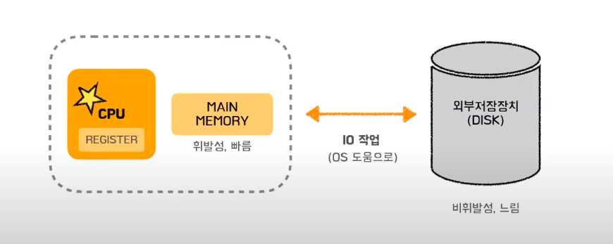

# Virtual Memory ( 가상 메모리 )

## 시작하기 전 간단한 컴퓨터 구조

---

MAIN MEMORY = RAM

DISk = Virtual Memory가 있음

fork() ⇒ 새 프로세스 생성

exec() ⇒ 로더를 호출 ( 로더는 새로 생성된 프로세스의 주소공간을 사용하여 지정된 실행 파일을 메모리에 올림 )

가상 메모리와 물리 메모리의 mapping을 관리해주는 하드웨어

## 개발 배경

---

- 기존에는 코드의 전부를 물리 메모리에 올려야 했다. → 메모리 용량보다 큰 프로그램은 실행 불가
    
    ⇒ 프로세스 전체가 메모리 내에 올라오지 않더라도 실행이 가능하도록 하는 기법
    

## Virtual Memory의 장점

---

- 물리 메모리 의존성이 줄어듬
- 추상화 → 접근 제어 → 보안
- 효율 증가
    - 메모리보다 더 큰 프로그램 실행 가능
    - 위의 이유로 여러 프로세스를 동시에 실행하고, 이는 시스템의 응답시간을 유지하면서 CPU 이용률과 처리율을 높인다.

## 가상 메모리 구조

---

1. 가상 주소 공간
    - 프로세스가 사용해야 하는 메모리 공간을 가상메모리에 주소로 저장하는 것
        - 32비트에서는 주소의 길이가 32비트 / 64비트에서는 주소의 길이가 64비트 이기 때문에, 64비트에서 더 많은 주소를 할당 할 수 있고. 이는 64비트가 더 많은 메모리를 사용할 수 있다.
            
            Because 64비트가 더 많은 논리 주소를 만들 수 있기 때문.
            
            - C언어에서 포인터 자료구조의 크기가 몇 비트로 컴파일 하냐에 따라 결정되는 이유
            - 자바에서는 참조 타입을 명시적으로 결정하지 않고, JVM에서 플랫폼에 맞춰서 알아서 결정함
                
                ⇒ 그렇기 때문에 64비트로 컴파일해도 참조타입은 4바이트가 될 수도 있음. ⇒ 개발자 명시 불가능 ⇒ JVM 마음대로 ⇒ 플랫폼에 맞게 잘 알아서 한다고 한다. ( 플랫폼은 운영체제 )
                
            
    - 각각의 프로세스에게 할당된 논리적인 공간
        - 프로세스가 필요로 하는 메모리 공간이 물리 메모리(RAM)에 적재되기 전에 가상 메모리 공간(하드디스크)에 셋팅 됨
        - 예시 :
            - 총 메모리 100kb가 요구되는 프로그램이 있다.
            - 이때 실행에 필요한 메모리 ( 100kb - 60kb )만을 물리메모리(RAM)에 올리고, free는 하드디스크(가상메모리)에서 필요할 때문 가져다가 쓴다.
            
            | Stack | free ( 60kb ) | Heap | Data | Code |
            | --- | --- | --- | --- | --- |
        
    
    ## 가상 메모리 사용 예시
    
    ---
    
    - 자바에서 객체가 실제로 생성되는 것은 처음 호출 된 후
        
        ⇒ 호출되기 전에는 Ram에 올라가지 않고 virtual memory에 있음
        
    - 시스템 라이브러리는 가상 메모리에 존재하다가, 해당 메모리가 사용되면 가상 주소 공간의 매핑을 찾아가 해당 메모리를 메인메모리에 올려 사용한다.
    - 멀티 프로세싱 개념에서 가상 메모리를 통해 데이터 공유가 가능하다. → 왜냐하면 주소를 통해 데이터를 참조할 수 있기 때문. (fork()를 통해 사용한다고 한다.)
    
    ## Demand Paging ( 요구 페이징 )
    
    ---
    
    - 프로그램 실행 시작 시에 프로그램 전체를 디스크에서 물리 메모리에 적재하는 대신, 초기에 필요한 것들만 적재하는 전략 ( 가상 메모리를 사용 )
    - 논리 메모리는 여러 개의 페이지라는 단위로 쪼개서 사용
    
    
    
    - 그렇다면 특정 페이지가 메인메모리에 올라와 있는지 구분은 어떻게?
        - 비트를 사용
        - Valid : 해당 페이지가 메모리에 있음
        - InValid : 해당 페이지가 메모리에 없음 ⇒ Page Fault : 다시 가져옴
    
    예시 : 
    
    
    
    1. 논리적 메모리 1번을 봅시다.
    
    1. 페이징 테이블 1번과 mapping되어 있는데 1번이 InValid이네요. 그러면 필요하겠죠?
    2. 그래서 물리적 메모리의 빈 공간에 B를 가져오고, 페이지 테이블을 UPDATE해줍니다.
    
    
    
    이러한 페이징 기법에는 다양한 알고리즘이 있다고 한다…
    
    Q.
    
    1. 가상 메모리가 무엇인가. ( 페이지와 메인메모리, 논리메모리를 키워드로 대답 )
    2. 자바의 참조 타입 자료형의 크기는?