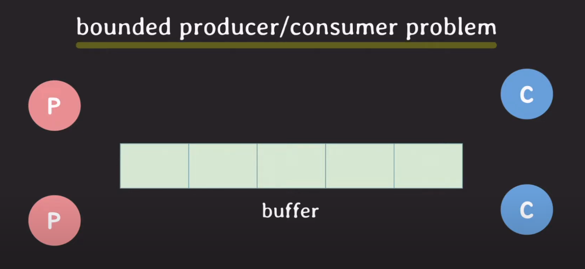

# 모니터

# 세마포어 && 뮤텍스

- 운영체제의 커널 내부에 구현된 임계영역 관리 기법

# 모니터

- 프로그래밍 언어에서 제공하는 고수준의 임계영역 관리 기법

⇒ 이러한 법칙은 절대적이지는 않지만, 대부분 그러하다. ( 어떤 운영체제에서는 커널단에서 모니터를 구현하여 사용하기도 한다. )

# 세마포어의 취약점

---

1. Deadlock
    - 두 개 이상의 프로세스가 서로의 자원을 기다리고 있어서 무한히 대기하는 상황
    - 두 프로세서가 자원을 하나 씩 차지하고 서로의 자원을 차지하기 위해 대기하는 상황
2. Race condition
    - 두 개 이상의 프로세스가 공유 자원에 동시에 접근하려고 할 때, 공유 자원을 잘못 사용할 수 있는 상황이 발생
    - 두 개의 프로세스가 동시에 세마포어를 P(wait) 연산으로 요청하면, 공유 자원을 제대로 사용하지 못할 수 있습니다.
3. Starvation
    - 프로세스가 세마포어의 자원을 사용하지 못하고 무한히 대기하는 상황이 발생
    - 세마포어의 값이 항상 0이면, 프로세스가 무한히 대기할 수 있습니다.

# 모니터

---

- 프로그래밍 언어 단에서 주로 사용하는 임계영역 접근 방법
- mutual exclusion을 보장 / 조건에 따라 스레드가 대기상태로 전환 기능
- 뮤텍스를 응용한 방법

### when?

- 한번에 하나의 스레드만 실행돼야 할 때
- 여러 스레드와 협업이 필요할 때

### 구성요소

- 뮤텍스
    - 전에 배운 뮤텍스 알고리즘
    - 동작도 유사함 ( 락이 없으면 Queue에 들어가 대기 )
- condition variable
    - waiting queue를 가짐 ( 조건이 충족되길 기다리는 스레드 들이 대기 상태로 머무름
    - 동작
        - wait : thread가 자기자신을 condition variable의 queue에 넣고 대기상태로 전환
        - signal : queue에서 하나를 깨움
        - broadcast : queue에서 전부를 깨움

- 

### 단어정리

- entry queue : 뮤텍스와 관련된 queue
- waiting queue : condition variable의 queue

### 기본 코드

```java
acquire(m); // 모니터의 락 취득(뮤텍스)

//임계영역 시작

while(!p){ // 조건 확인

// 코딩 방식에 따라 중간에 wait을 해야하는 상황
// m = 뮤텍스 락 ( wait을 하면 lock을 쥐고있으면 안됨 ) / cv = 자기자신을 인자로 queue에 저장
// 조건 충족 안도면 waiting ( condition variable )
// 다시 실행될 때는 lock을 가지고 와야 함
	wait(m,cv) 

}

.
.
.
//다른 스레드가 조건을 충족시키면 깨워준다.
signal(cv2);  or broadcast(cv2) // cv2와 cv가 같을 수도 있음 ( condition variable )

//임계영역 종료
release(m); // 모니터의 락 반환(뮤텍스)
```

예제를 풀면서 음미해봅시다.



규칙

1. buffer는 배열 ( size = 5 )
2. p는 Producer : 호출될 때마다 buffer에 한 개의 데이터를 넣음
3. c는 Consumer : 호출될 때마다 buffer에서 데이터 한 개의 데이터를 꺼내서 사용함
4. p는 배열이 꽉 찼는지 계속해서 확인 해야 하고, c는 배열이 비어있는지 확인 해야 함

갑자기 consumer, producer, consumer가 도착했다. 어떻게 동작하는가?

### 문제 해결 코드


# JAVA에서 모니터

---

- 자바에서는 모든 객체는 내부적으로 모니터를 가진다.
    - mutual exclusion 기능 = synchronized
- 자바의 모니터는 condition variable을 하나만 가진다.
- 자바 모니터 동작 ( synchronized 내부에서만 사용 가능 )
    - wait
    - notify → 자바의 어떤 정책에 따라 개발자는 알 수 없는 우선순위로 깨움
    - notifyAll
    
    synchronized 키워드 사용법
    
    1. 메서드 선언에서 사용 ex ) public synchronized void produce(int item){}
    2. 메서드 내부에서 사용 ex ) synchronized(this){}
        - 파라미터(락)을 전달
        - this = 객체 자기 자신의 락
        
    
    
    
    - 다만 자바는 모니터에서 queue를 하나만 제공한다.
    - 그래서 혹시 queue가 두 개 필요하다면 직접 구현해야한다.
    - java.util.concurrent에 동기화 기능 class가 있으니, 필요하면 참조