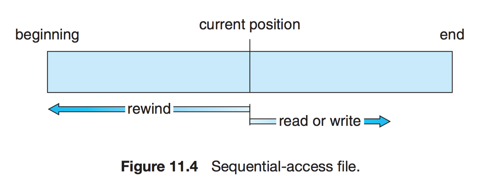

# 파일 시스템 ( File System )

---

- OS에 의해 “파일단위”를 쉽게 방법 시스템
- 컴퓨터는 정보들을 자기 디스크, 자기 테이프, 광 디스크와 같은 다양한 저장 매체에 저장할 수 있다. 운영체제는 저장장치의 물리적 특성을 추상화하여 논리적 저장 단위, 즉 **파일** 을 정의한다. 파일은 운영체제에 의해 물리 장치들로 맵핑되고, 일반적으로 비휘발적 특성을 지니기 때문에, 전원이 끊어진 상황에서도 정보들을 영구히 보존할 수 있다.
- 사용자의 입장에서 파일은 논리적 보조 저장장치의 가장 작은 할당 단위이다.
- 파일은 일반적으로 **프로그램**과 **자료**로 나누어진다.
    - **프로그램** : 소스 프로그램, 목적 프로그램으로 나누어 진다.
    - **자료** : 숫자,문자,이진수, 자유 형식이거나 정해진 형식 등, 저장할 수 있는 모든 것이 자료가 될 수 있다.

## 특징

---

- 커널에서 동작
- 파일의 CRUD 기능 수행을 목적으로 함
- 계층적 디렉토리 구조
- 디스크 파티션 별로 하나씩 둘 수 있음

## 역할

---

- 파일 관리
- 보조 저장소 관리
- 파일 무결성 메커니즘
- 접근 방법 제공

## 개발 목적

---

- 하드디스크와 메인 메모리 속도차를 줄이기 휘마
- 파일 관리
- 하드디스크 용량 효율적 사용

## 구조

---

- 메타 영역 : 파일의 이름, 위치, 크기, 저장시간, 삭제유무 등의 정보 저장
- 데이터 영역 : 파일의 데이터

## 접근 방법

---

1. 순차 접근 ( Sequential Access )
    
    가장 기본적인 접근 방법 ( 구현이 쉬움 ) —> pointer하나 두고 파일 위치까지 이동해서 읽고 쓰기
    
    
    
- 포인터를 통해 위치를 가리킴
- 시스템 콜이 발생할 경우 포인터를 옮기고 read면 한칸씩 앞으로, write면 맨 뒤에서 부터 한칸씩 뒤로 이동하며 순차적으로 접근

⇒ 이를 해결하기 위해 레코드 블록화(record block)를 활용 ⇒ 데이터를 블록 단위로 읽음 ( 기존에 1 바이트씩 읽었다면, 임의로 16바이트로 블럭을 설정하여 더 조금 읽는 방식 )

1. 직접 접근 ( Direct Access )
    
    특별한 순서 없이, 빠르게 레코드를 read, write 가능
    
    
    
    현재 위치를 가리키는 cp 변수를 만들어서 순차 파일 기능을 구현 가능
    
    무작위 파일 블록에 대한 임의 접근을 허용한다. ( 순서에 대한 제약이 없다 )
    
    대규모 정보를 접근할 때 유용하기 때문에 DB에서 활용
    
    1. 기타 접근
        
        직접 접근 파일에 기반하여 색인 구축
        
    
    
    
    크기가 큰 파일의 입출력을 색인으로 저장하여 접근
    
    ## 디렉터리와 디스크 구조
    
    ---
    
    ### 1단계 디렉터리
    
    - 파일들은 서로 유일한 이름을 가짐
    
    
    
    ### 2단계 디렉터리
    
    - 사용자에게 개별적인 디렉터리를 만들어줌
        - UFD : 자신만의 사용자 파일 디렉터리
        - MFD : 사용자의 이름과 계정번호로 색인되어 있는 디렉터리
        
        
        
        ### 트리 구조 디렉터리
        
        - 2단계 구조 디렉터리에서 확장된 다단계 트리 구조
        - 하나의 비트를 사용해, 일반 파일 (0), 디렉터리 파일 (1) 구분
        
        
        
        ### 그래프 구조 디렉터리
        
        - 순환이 발생하지 않도록 하위 디렉터리가 아닌 파일에 대한 링크만 허용하거나, 가비지 컬렉션을 이용해 전체 파일 시스템을 순회하고 접근이 가능한 모든 것을 표시
        - 링크가 있으면 우회하여 순환을 피할 수 있음
        
        
        
        참고 : [https://noep.github.io/2016/02/23/10th-filesystem/](https://noep.github.io/2016/02/23/10th-filesystem/)