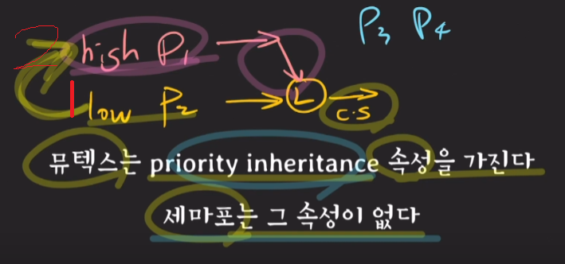

# 프로세스 동기화 전략 ( Mutial Exclusion )

# 부제 : 세마포어 && 뮤텍스

## 서론

- 멀티 프로세싱, 멀티 스레드 환경에서 데드락이 일어날 수 있는 조건 1번 (상호 배제)에 대한 이슈
- 멀티 프로세싱 환경에서는 동기화에 대한 이슈가 있고 해결해야 함
  - 공유자원에 대해서 동시에 동작하는 두 프로세스(스레드)가 서로를 어떻게 배려할 것인가?
  - 만약 공유자원을 수정하지 않고 값만 사용하는 것이라면 이러한 고민은 필요 X

## 문제 정의 : Critical Section ( 임계 영역 )

- 프로세스들이 Critical Section을 함께 사용하도록 프로토콜을 “알잘딱갈센”하게 설계하는 것

## Critical Section 문제 해결을 위한 3가지 전제

1. 상호 배제 ( Mutial Exclusion ) : 두 프로세스가 동시에 임계영역의 데이터를 조작하여 임계영역의 데이터가 의도치 않게 사용되는 것을 막는다.
   - 데드락을 감안해도 필요한 조건
2. 진행 ( Progress ) : 임계 영역을 사용하려는 프로세스가 없다면, 다른 프로세스가 임계 영역을 사용한다.
3. 한정 대기 ( Bounding Waiting ) : 모든 프로세스는 일정 시간 내에 임계영역에 반드시 입장해야 한다.
   - 기아상태를 방지하기 위한 조건

→ 기본적으로 임계영역을 해결하기 위한 알고리즘은 싱글턴으로 하나의 인스턴스를 생성한다.

→ **`java.util.concurrent`** 패키지에서 spin lock, mutex, semaphore 객체, 인터페이스를 제공

## 1. SPIN LOCK

- 계속해서 LOCK의 상태를 확인하여, 사용이 가능한 상태가 되면 LOCK을 걸고, 실행하는 알고리즘
- 자원을 사용 가능 할 때까지 계속해서 반복문을 돌며 자원에 접근 시도

JAVA 예시 구현 코드

```java
class SpinLock {
  private volatile boolean lock = false;
 // 공유 자원에 대한 락 상태를 저장하는 변수, volatile 키워드를 사용하여 캐시 일관성 문제 방지

  public void acquire() {
    while (true) {
      while (lock) { // 다른 프로세스가 락을 사용하고 있으면 대기
        Thread.yield(); // CPU를 다른 스레드에게 양보
      }
      if (!lock) { // 락이 사용 가능한 상태라면
        lock = true; // 락을 사용 중으로 변경
        return;
      }
    }
  }

  public void release() {
    lock = false; // 락을 사용 가능한 상태로 변경
  }
}
```

# 2. Mutex

- lock을 획득하지 못하면 wait상태로 기다리다가, 다른 프로세서가 release를 할때, wait중인 다른 프로세서를 깨움
- spinlock에서 계속 while을 통해 조회하던 것과 비교하여 Mutex는 wait상태로 기다린다. ( wait queue 에서 대기 중 )

```java
class Mutex {
    private boolean locked = false;

    public synchronized void acquire() throws InterruptedException {
        while (locked) {
            wait(); // 다른 스레드가 락을 사용 중이면 대기
        }
        locked = true;
    }

    public synchronized void release() {
        locked = false;
        notifyAll(); // 대기 중인 스레드를 모두 깨움
    }
}
```

# 3. Semaphore

- lock을 boolean이 아닌 int형식으로 선언해서 여러 개의 프로세스가 임계영역에 진입하는 것을 허용하는 방식
- 그러나 임계영역에 여러 프로세스가 진입하면 동기화에 문제가 생길 수 있다. 그렇기 때문에 세마포어 방식의 설계는 단순히 진입에 대한 처리 뿐만 아니라, 같은 데이터에 대한 접근을 제한하거나, 순서를 잘 설정하는 등 들어간 뒤의 후처리도 필요하다.
- 이런게 싫으면 이진 세마포어를 사용해라

```jsx
import java.util.concurrent.locks.*;

public class SemaphoreExample {
    private final Lock lock = new ReentrantLock();
    private final Condition permitAvailable = lock.newCondition();
    private int permits;

    public SemaphoreExample(int initialPermits) {
        if (initialPermits < 0) {
            throw new IllegalArgumentException("Initial permit count must be non-negative");
        }
        permits = initialPermits;
    }

    public void acquire() throws InterruptedException {
        lock.lock();
        try {
            while (permits <= 0) { // 더 이상 permit이 없으면 대기
                permitAvailable.await();
            }
            permits--;
        } finally {
            lock.unlock();
        }
    }

    public void release() {
        lock.lock();
        try {
            permits++;
            permitAvailable.signal(); // 대기 중인 스레드를 깨움
        } finally {
            lock.unlock();
        }
    }
}
```

# 각 방식 간의 비교

## Spin Lock VS Mutex

차이점 정의 : 임계영역에 대한 접근에 대한 차이

spinLock : while로 계속 방문 조회

Mutex : wait하고 있다가, notifyAll()을 통해 wait중인 프로세스 깨움

- SpinLock은 while을 돌며 cpu자원을 계속해서 소모
- Mutex는 wait상태로 대기하기 때문에 자원을 효율적으로 사용

but

⇒ 임계영역에 들어가는 시간이 매우 짧아서 Context Switching이 매우 자주 일어난다면?

- SpinLock은 계속 cpu 자원을 먹기 때문에 Context Switching이 필요 없이 계속 while로 cpu내에서 대기하다가 일하면 됨
- Mutex는 wait상태로 대기하기 위해 cpu 밖으로 나갔다가, 다시 cpu로 들어와야 함

⇒ Context Switching이 자주 일어나는 상황에서는 Spin Lock이 더 효율적

## Mutex VS Binary Semaphore

( Binary Semaphore : permit 값을 1로 줘서 하나의 프로세서만 진입이 가능한 세마포어 )

- 둘 다 데드락의 1번 상호 배제 ( Mutual exclusion )구현하기 위한 동기화 기법

차이점 정의 :

- 뮤텍스
  - Prioirty inheritance속성을 가짐
    - 설명 :
      1. 우선순위 1인 P2가 실행 중
      2. 우선순위 10인 P1이 대기 중
      3. P2의 우선순위를 10으로 바꿔주고 자원을 반납함
      4. p1이 프로세서를 사용 한 뒤에 우선순위를 높여줬던 p2가 다시 동작
    - 만약 이러한 속성이 없다면?
      1. 우선순위 1인 P2가 실행 중
      2. 우선순위 10인 P1이 대기 중
      3. P2의 우선순위를 10으로 바꿔주고 자원을 반납함
      4. p1이 실행함
      5. 우선순위 5인 p3가 와서 p1뒤에 실행
      6. p2은 계속해서 기아상태
- 이진 세마포어
  - 구현 간단간단


