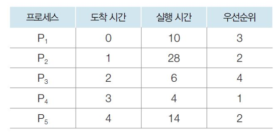

# 3STAR 면접 ver0.1

1. 스레드란?

1. 싱글톤이란?

1. 우선순위 스케줄링이란

1. 우선순위 스케줄링 반환시간, 대기시간을 계산하시오

1. 스케줄링시 고려해야할 점

1. 활성함수가 없다면 어떤일이 일어날까요?

1. 체크섬의 한계는?

1. JAVA를 이용해 멀티스레딩 프로그래밍을 했다. 그런데 동작1과 동작2를 동시에 진행했더니 동작2에 대한 처리가 이상하다. 어떻게 해결해야할까?

---

형준이의 스크립트

1. 스레드란?
- 프로세스 내에서 실행되는 흐름. 프로세스는 코드, 힙, 데이터 영역과 한개 이상의 스택으로 구성되어 지는데, 이 스택이 스레드입니다. 이 스택에는 함수의 실행부터 변수, 동작 등이 스택 자료구조가 저장되는 순서로 실행이 되는데, 이를 스레드라고 합니다.

1. 싱글톤이란?
- 싱글톤이란 객체지향설계에서 하나의 인스턴스를 생성하여 전역으로 사용하는 디자인 패턴입니다. 자바에서는 생성자를 private로 선언하고, getInstance함수 호출 시 해당 객체가 private로 선언하고 있는 자신을 return하여 단 하나의 객체만 생성하도록 구현합니다.

1. 우선순위 스케줄링이란?
- 스케줄링을 결정하는 기준에서 우선순위를 최우선 기준으로 두는 스케줄링 방법입니다. 대부분의 운영체제에서 우선순위 스케줄링 기법을 채택하고 있습니다.

1.  우선순위 스케줄링 반환시간, 대기시간을 계산하시오

1

반환시간, 대기시간

1. 16, 16 - 10
2. 44,  44 - 28
3. 8, 8 - 6
4. 62, 62 - 4
5. 58, 58 - 14

1. 스케줄링시 고려해야할 점

선점 가능 여부를 결정하고, 어떠한 지표를 기준으로 스케줄링 할지 정해야 합니다. 대부분의 운영체제에서 우선순위 스케줄링을 사용하기 때문에, 우선순위 할당에 대해 중요하게 고려해야 합니다.