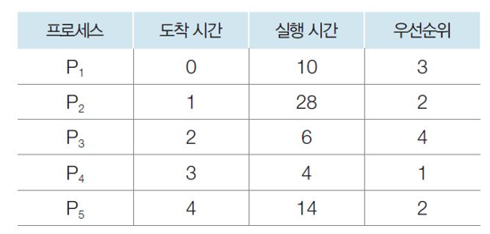

# 3STAR 면접 ver0.1

1. 스레드란?

2. 싱글톤이란?

3. 우선순위 스케줄링이란

4. 우선순위 스케줄링 반환시간, 대기시간을 계산하시오

5. 스케줄링시 고려해야할 점

6. JAVA를 이용해 멀티스레딩 프로그래밍을 했다. 그런데 동작1과 동작2를 동시에 진행했더니 동작2에 대한 처리가 이상하다. 어떻게 해결해야할까?

---

형준이의 스크립트

1. 스레드란?
- 프로세스 내에서 실행되는 흐름. 프로세스는 코드, 힙, 데이터 영역과 한개 이상의 스택으로 구성되어 지는데, 이 스택이 스레드입니다. 이 스택에는 함수의 실행부터 변수, 동작 등이 스택 자료구조가 저장되는 순서로 실행이 되는데, 이를 스레드라고 합니다.

2. 싱글톤이란?
- 싱글톤이란 객체지향설계에서 하나의 인스턴스를 생성하여 전역으로 사용하는 디자인 패턴입니다. 자바에서는 생성자를 private로 선언하고, getInstance함수 호출 시 해당 객체가 private로 선언하고 있는 자신을 return하여 단 하나의 객체만 생성하도록 구현합니다.

3. 우선순위 스케줄링이란?
- 스케줄링을 결정하는 기준에서 우선순위를 최우선 기준으로 두는 스케줄링 방법입니다. 대부분의 운영체제에서 우선순위 스케줄링 기법을 채택하고 있습니다.

4.  우선순위 스케줄링 반환시간, 대기시간을 계산하시오

반환시간, 대기시간

1. 16, 16 - 10
2. 44,  44 - 28
3. 8, 8 - 6
4. 62, 62 - 4
5. 58, 58 - 14

5. 스케줄링시 고려해야할 점

선점 가능 여부를 결정하고, 어떠한 지표를 기준으로 스케줄링 할지 정해야 합니다. 대부분의 운영체제에서 우선순위 스케줄링을 사용하기 때문에, 우선순위 할당에 대해 중요하게 고려해야 합니다.

6. 임계영역에 두 스레드가 동시접근에 접근하는 동기화 전략에 문제가 있는 것으로 보입니다. 자바에서는 이러한 동기화 전략을 위해 Synchronized 키워드를 제공하고 있습니다. 멀티 스레드 환경에서 해당 키워드를 사용할 시, 내부적으로 모니터 알고리즘을 통해 임계영역에 동기화해서 데이터를 처리합니다.

=> 그러면 모니터 알고리즘에 대해 설명해봐라

모니터알고리즘은 뮤텍스알고리즘을 개선한 알고리즘이다. 기본적으로 뮤텍스를 통해 key를 가진 스레드가 동작하게 되는데, 여기서 한번 더 조건으로 걸어 특정한 환경에서 알고리즘이 동작할 수 있는 환경인지를 while문을 통해 체크한다. 자바의 synchronized에서 조금 특이한 점은 뮤텍스의 키 획득 queue와 내부의 while문을 통해 환경을 체크하는 queue을 하나의 queue를 통해 관리한다는 점입니다.